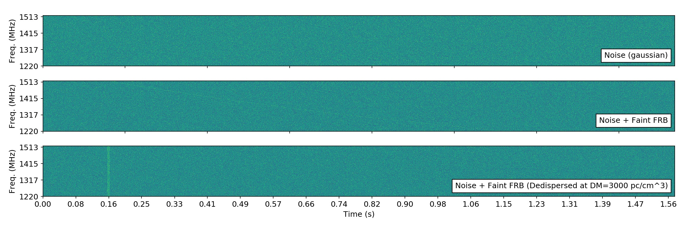
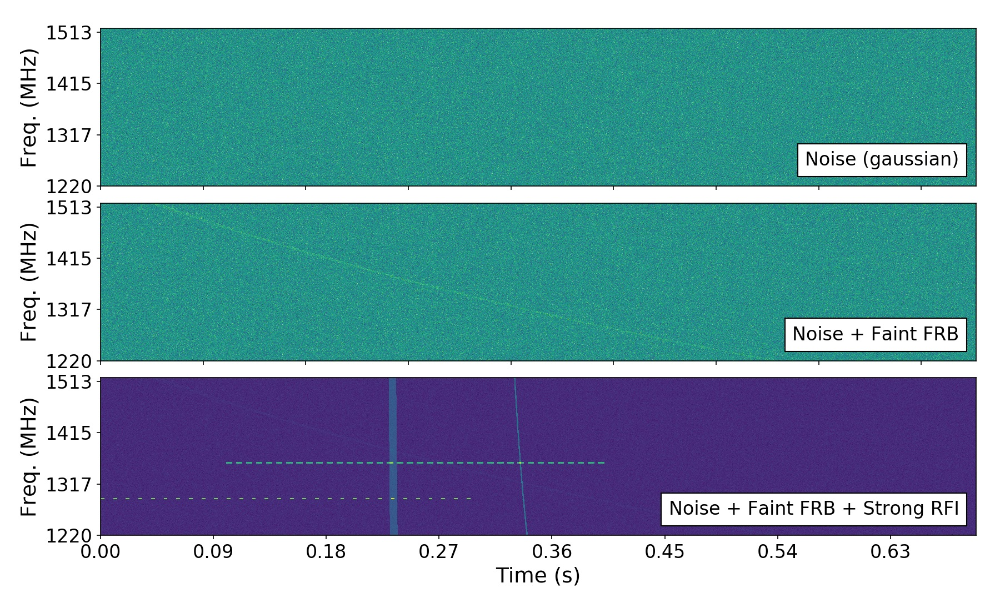
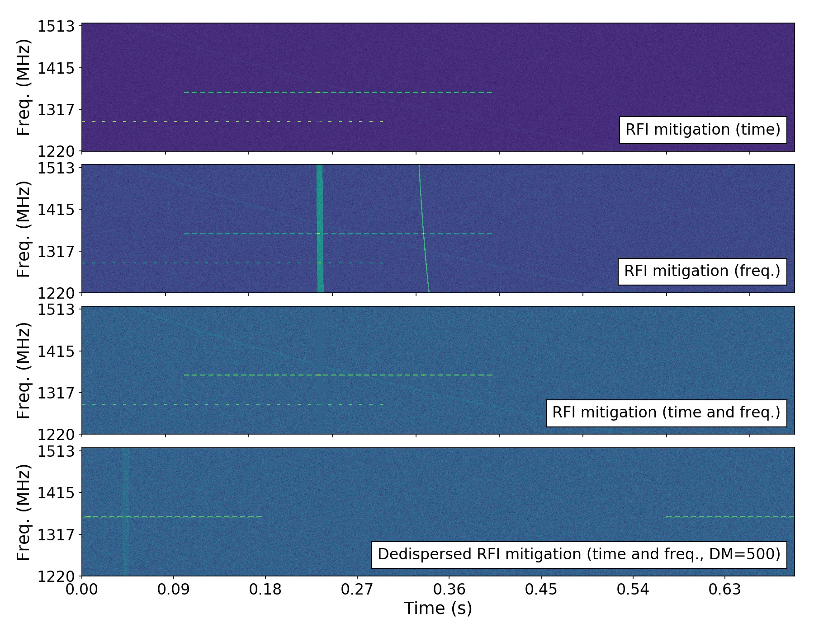

Time-domain astronomy sandbox
=============================

A series of classes to simulate time-domain astronomy data products.

.. image:: https://readthedocs.org/projects/time-domain-astronomy-sandbox/badge/?version=latest
    :target: https://time-domain-astronomy-sandbox.readthedocs.io/en/latest/?badge=latest
    :alt: Documentation Status

.. image:: https://img.shields.io/badge/Launch-binder-579ACA.svg?logo=data:image/png;base64,iVBORw0KGgoAAAANSUhEUgAAAFkAAABZCAMAAABi1XidAAAB8lBMVEX///9XmsrmZYH1olJXmsr1olJXmsrmZYH1olJXmsr1olJXmsrmZYH1olL1olJXmsr1olJXmsrmZYH1olL1olJXmsrmZYH1olJXmsr1olL1olJXmsrmZYH1olL1olJXmsrmZYH1olL1olL0nFf1olJXmsrmZYH1olJXmsq8dZb1olJXmsrmZYH1olJXmspXmspXmsr1olL1olJXmsrmZYH1olJXmsr1olL1olJXmsrmZYH1olL1olLeaIVXmsrmZYH1olL1olL1olJXmsrmZYH1olLna31Xmsr1olJXmsr1olJXmsrmZYH1olLqoVr1olJXmsr1olJXmsrmZYH1olL1olKkfaPobXvviGabgadXmsqThKuofKHmZ4Dobnr1olJXmsr1olJXmspXmsr1olJXmsrfZ4TuhWn1olL1olJXmsqBi7X1olJXmspZmslbmMhbmsdemsVfl8ZgmsNim8Jpk8F0m7R4m7F5nLB6jbh7jbiDirOEibOGnKaMhq+PnaCVg6qWg6qegKaff6WhnpKofKGtnomxeZy3noG6dZi+n3vCcpPDcpPGn3bLb4/Mb47UbIrVa4rYoGjdaIbeaIXhoWHmZYHobXvpcHjqdHXreHLroVrsfG/uhGnuh2bwj2Hxk17yl1vzmljzm1j0nlX1olL3AJXWAAAAbXRSTlMAEBAQHx8gICAuLjAwMDw9PUBAQEpQUFBXV1hgYGBkcHBwcXl8gICAgoiIkJCQlJicnJ2goKCmqK+wsLC4usDAwMjP0NDQ1NbW3Nzg4ODi5+3v8PDw8/T09PX29vb39/f5+fr7+/z8/Pz9/v7+zczCxgAABC5JREFUeAHN1ul3k0UUBvCb1CTVpmpaitAGSLSpSuKCLWpbTKNJFGlcSMAFF63iUmRccNG6gLbuxkXU66JAUef/9LSpmXnyLr3T5AO/rzl5zj137p136BISy44fKJXuGN/d19PUfYeO67Znqtf2KH33Id1psXoFdW30sPZ1sMvs2D060AHqws4FHeJojLZqnw53cmfvg+XR8mC0OEjuxrXEkX5ydeVJLVIlV0e10PXk5k7dYeHu7Cj1j+49uKg7uLU61tGLw1lq27ugQYlclHC4bgv7VQ+TAyj5Zc/UjsPvs1sd5cWryWObtvWT2EPa4rtnWW3JkpjggEpbOsPr7F7EyNewtpBIslA7p43HCsnwooXTEc3UmPmCNn5lrqTJxy6nRmcavGZVt/3Da2pD5NHvsOHJCrdc1G2r3DITpU7yic7w/7Rxnjc0kt5GC4djiv2Sz3Fb2iEZg41/ddsFDoyuYrIkmFehz0HR2thPgQqMyQYb2OtB0WxsZ3BeG3+wpRb1vzl2UYBog8FfGhttFKjtAclnZYrRo9ryG9uG/FZQU4AEg8ZE9LjGMzTmqKXPLnlWVnIlQQTvxJf8ip7VgjZjyVPrjw1te5otM7RmP7xm+sK2Gv9I8Gi++BRbEkR9EBw8zRUcKxwp73xkaLiqQb+kGduJTNHG72zcW9LoJgqQxpP3/Tj//c3yB0tqzaml05/+orHLksVO+95kX7/7qgJvnjlrfr2Ggsyx0eoy9uPzN5SPd86aXggOsEKW2Prz7du3VID3/tzs/sSRs2w7ovVHKtjrX2pd7ZMlTxAYfBAL9jiDwfLkq55Tm7ifhMlTGPyCAs7RFRhn47JnlcB9RM5T97ASuZXIcVNuUDIndpDbdsfrqsOppeXl5Y+XVKdjFCTh+zGaVuj0d9zy05PPK3QzBamxdwtTCrzyg/2Rvf2EstUjordGwa/kx9mSJLr8mLLtCW8HHGJc2R5hS219IiF6PnTusOqcMl57gm0Z8kanKMAQg0qSyuZfn7zItsbGyO9QlnxY0eCuD1XL2ys/MsrQhltE7Ug0uFOzufJFE2PxBo/YAx8XPPdDwWN0MrDRYIZF0mSMKCNHgaIVFoBbNoLJ7tEQDKxGF0kcLQimojCZopv0OkNOyWCCg9XMVAi7ARJzQdM2QUh0gmBozjc3Skg6dSBRqDGYSUOu66Zg+I2fNZs/M3/f/Grl/XnyF1Gw3VKCez0PN5IUfFLqvgUN4C0qNqYs5YhPL+aVZYDE4IpUk57oSFnJm4FyCqqOE0jhY2SMyLFoo56zyo6becOS5UVDdj7Vih0zp+tcMhwRpBeLyqtIjlJKAIZSbI8SGSF3k0pA3mR5tHuwPFoa7N7reoq2bqCsAk1HqCu5uvI1n6JuRXI+S1Mco54YmYTwcn6Aeic+kssXi8XpXC4V3t7/ADuTNKaQJdScAAAAAElFTkSuQmCC
   :target: https://mybinder.org/repo/macrocosme/time_domain_astronomy_sandbox/Usage%20example.ipynb

.. image:: docs/source/_static/dispersed_dedispersed_dm_3000.png

Classes includes:
    - ``Backend``: properties describing an observatory backend,
    - ``Pulse``: a broadband dispersed pulse,
    - ``Observation``: an observation data product generated for a given ``Backend``,
    - ``RFIm``: radio frequency interference mitigation functions,
    - ``Plotting``: plotting functions.

Copyright (c) Dany Vohl. 2019.

Getting started
---------------
          
Instanciate a Backend using your preferred properties and use as argument to instanciate an Observation.
You can then add Pulses via add_dispersed_pulse (Pulse()) and add_rfi.

You can test it for yourself by starting the "Usage example.ipynb" jupyter notebook with the same name on Binder_ (it takes a few second to launch the server).

.. _Binder: https://mybinder.org/repo/macrocosme/time_domain_astronomy_sandbox/Usage%20example.ipynb

Usage examples
--------------

1. Load classes:  

.. code-block:: python

    	from time_domain_astronomy_sandbox.backend import Backend
	from time_domain_astronomy_sandbox.observation import Observation
	from time_domain_astronomy_sandbox.pulse import Pulse
	from time_domain_astronomy_sandbox.plotting import plot_multi_images, plot_multi_1D
	from time_domain_astronomy_sandbox.rfim import RFIm
	

2. Plot a dispersed pulse interactively (using `ipywidgets`)

.. code-block:: python

	def interactive_pulse_arts():
	    """Plot interactive dispersed pulse using ASTRON's ARTS backend."""
	    pulse = Pulse(Backend())
	    pulse.plot_delay_v_frequency_interactive(xscale='linear')

	interactive_pulse_arts()
	
3. Plot low- and high-DM broadband dispersed pulses, narrowband periodic pulses, and run RFI cleaning. 

.. code-block:: python 

	from matplotlib import rc

	def pulse_and_rfi__cleaned():
	    obs = Observation(Backend(), length=1.024/1.5)
	    raw = obs.window.copy()
	    obs.add_dispersed_pulse(dm=500, width=0.006, pulse_t0=0.04, snr=15)
	    frb = obs.window.copy()
	    obs.add_dispersed_pulse(dm=1, width=0.006, pulse_t0=0.23, snr=125)
	    obs.add_dispersed_pulse(dm=10, width=0.001, pulse_t0=0.33, snr=125)

	    for t_start, t_step, t_width, f1, f2 in [
	        [0., 0.01, 0.003, 350, 360], 
	        [0.1, 0.008, 0.005, 700, 715], 
	    ]:
	        obs.add_rfi(
	            t_start=t_start,
	            t_stop=t_start+0.3,
	            t_step=t_step,
	            t_width=t_width,

	            f_start=f1, 
	            f_stop=f2,

	            snr=125,
	        )

	    xstep = 1100
	    ystep = 500

	    rc('font', size=16)
	    rc('axes', labelsize=18)

	    o_window = obs.window.copy()

	    plot_multi_images(
	        (
	            raw,
	            frb,
	            o_window,
	        ),

	        labels=(
	            'Noise (gaussian)',
	            'Noise + Faint FRB',
	            'Noise + Faint FRB + Strong RFI',
	        ),

	        direction='vertical',

	        xticks=obs.time_indices[::xstep],
	        xtick_labels=["%.2f" % t for t in obs.times[::xstep]],

	        yticks=obs.backend.freq_indices[::ystep],
	        ytick_labels=["%.0f" % f for f in obs.backend.frequencies[::ystep]],

	        xfig_size=12,
	        yfig_size=7.3,
	        spectrum=False,
	        colorbar=False,
	        savefig=False,
	        fig_name='noise_pulses_rfi',
	        ext='pdf'
	    )

	    o_tc = RFIm().tdsc_amber(obs.window.copy())
	    o_fc = RFIm().fdsc_amber(obs.window.copy())
	    plot_multi_images(
	        (
	            o_tc,
	            o_fc,
	            obs.frequency_cleaning(obs.time_cleaning(), keep_state=True),
	            obs.dedisperse(dm=500),
	        ),

	        labels=(
	            'RFI mitigation (time)',
	            'RFI mitigation (freq.)',
	            'RFI mitigation (time and freq.)',
	            'Dedispersed RFI mitigation (time and freq., DM=500)',
	        ),

	        direction='vertical',

	        xticks=obs.time_indices[::xstep],
	        xtick_labels=["%.2f" % t for t in obs.times[::xstep]],

	        yticks=obs.backend.freq_indices[::ystep],
	        ytick_labels=["%.0f" % f for f in obs.backend.frequencies[::ystep]],

	        xfig_size=12,
	        yfig_size=9.4,
	        spectrum=False,
	        colorbar=False,
	        savefig=False,
	        fig_name='rficlean',
	        ext='pdf'
	    )

	pulse_and_rfi__cleaned()
	
Input data
----------
	

Applying RFI mitigation
-----------------------

This project is licensed under the terms of the GNU GPL v3+ license. Conditions can be found online.
