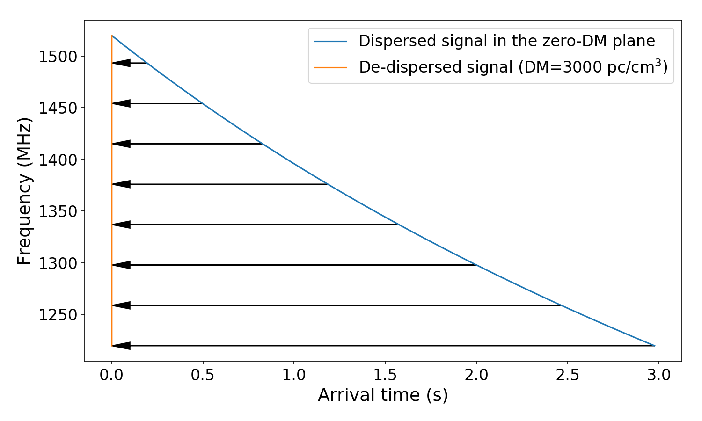

.. amber_meta documentation master file, created by
   sphinx-quickstart on Sat Mar  9 10:02:46 2019.
   You can adapt this file completely to your liking, but it should at least
   contain the root `toctree` directive.

Documentation for time_domain_astronomy_sandbox
===============================================

This package consists of a series of classes to simulate time-domain astronomy data products.

Classes includes:
    - ``Backend``: properties describing an observatory backend,
    - ``Pulse``: a broadband dispersed pulse,
    - ``Observation``: an observation data product generated for a given ``Backend``,
    - ``RFIm``: radio frequency interference mitigation functions,
    - ``Plotting``: plotting functions.

Copyright (c) Dany Vohl. 2019.

Getting the code
----------------

.. code-block:: shell

    git clone https://github.com/macrocosme/time_domain_astronomy_sandbox.git
    cd time_domain_astronomy_sandbox/
    pip[3] install -r requirements.txt

Requirements
----------------

.. code-block:: shell

    ## These can't be pip installed
    # sigproc
    # filterbank
    # http://github.com/liamconnor/arts-analysis

    # pip[3] install -r requirements.txt
    numpy>=1.17.0
	matplotlib>=2.1.2
	ipywidgets>=7.4.1

Usage examples
--------------

1. Load classes:  

.. code-block:: python

    from time_domain_astronomy_sandbox.backend import Backend
	from time_domain_astronomy_sandbox.observation import Observation
	from time_domain_astronomy_sandbox.pulse import Pulse
	from time_domain_astronomy_sandbox.plotting import plot_multi_images, plot_multi_1D
	from time_domain_astronomy_sandbox.rfim import RFIm
	

2. Plot a dispersed pulse interactively (using `ipywidgets`)

.. code-block:: python

	def interactive_pulse_arts():
	    """Plot interactive dispersed pulse using ASTRON's ARTS backend."""
	    pulse = Pulse(Backend())
	    pulse.plot_delay_v_frequency_interactive(xscale='linear')

	interactive_pulse_arts()
	
3. Plot low- and high-DM wideband dispersed pulses, narrowband periodic pulses, and run RFI cleaning. 

.. code-block:: python 

	def pulse_and_rfi__cleaned():
	    obs = Observation(Backend(), length=1.024/1.5)
	    raw = obs.window.copy()
	    obs.add_dispersed_pulse(dm=500, width=0.006, pulse_t0=0.04, snr=15)
	    frb = obs.window.copy()
	    obs.add_dispersed_pulse(dm=1, width=0.006, pulse_t0=0.23, snr=125)
	    obs.add_dispersed_pulse(dm=10, width=0.001, pulse_t0=0.33, snr=125)

	    for t_start, t_step, t_width, f1, f2 in [
	        [0., 0.01, 0.003, 350, 360], 
	        [0.1, 0.008, 0.005, 700, 715], 
	    #     [0.2, 0.007, 0.004, 1220, 1255]
	    ]:
	        obs.add_rfi(
	            t_start=t_start,
	            t_stop=t_start+0.3,
	            t_step=t_step,
	            t_width=t_width,

	            f_start=f1, 
	            f_stop=f2,

	            snr=125,
	        )

	    xstep = 1100
	    ystep = 500

	    rc('font', size=16)
	    rc('axes', labelsize=18)

	    o_window = obs.window.copy()

	    plot_multi_images(
	        (
	            raw,
	            frb,
	            o_window,
	        ),

	        labels=(
	            'Noise (gaussian)',
	            'Noise + Faint FRB',
	            'Noise + Faint FRB + Strong RFI',
	        ),

	        direction='vertical',

	        xticks=obs.time_indices[::xstep],
	        xtick_labels=["%.2f" % t for t in obs.times[::xstep]],

	        yticks=obs.backend.freq_indices[::ystep],
	        ytick_labels=["%.0f" % f for f in obs.backend.frequencies[::ystep]],

	        xfig_size=12,
	        yfig_size=7.3,
	        spectrum=False,
	        colorbar=False,
	        savefig=False,
	        fig_name='noise_pulses_rfi',
	        ext='pdf'
	    )

	    o_tc = RFIm().tdsc_amber(obs.window.copy())
	    o_fc = RFIm().fdsc_amber(obs.window.copy())
	    plot_multi_images(
	        (
	            o_tc,
	            o_fc,
	            obs.frequency_cleaning(obs.time_cleaning(), keep_state=True),
	            obs.dedisperse(dm=500),
	        ),

	        labels=(
	            'RFI mitigation (time)',
	            'RFI mitigation (freq.)',
	            'RFI mitigation (time and freq.)',
	            'Dedispersed RFI mitigation (time and freq., DM=500)',
	        ),

	        direction='vertical',

	        xticks=obs.time_indices[::xstep],
	        xtick_labels=["%.2f" % t for t in obs.times[::xstep]],

	        yticks=obs.backend.freq_indices[::ystep],
	        ytick_labels=["%.0f" % f for f in obs.backend.frequencies[::ystep]],

	        xfig_size=12,
	        yfig_size=9.4,
	        spectrum=False,
	        colorbar=False,
	        savefig=False,
	        fig_name='rficlean',
	        ext='pdf'
	    )

	pulse_and_rfi__cleaned()

License
-------

   This project is licensed under the terms of the GNU GPL v3+ license.

Index
-----

.. toctree::
   :maxdepth: 1
   :caption: Contents:

   backend
   pulse
   observation
   rfim
   plotting
